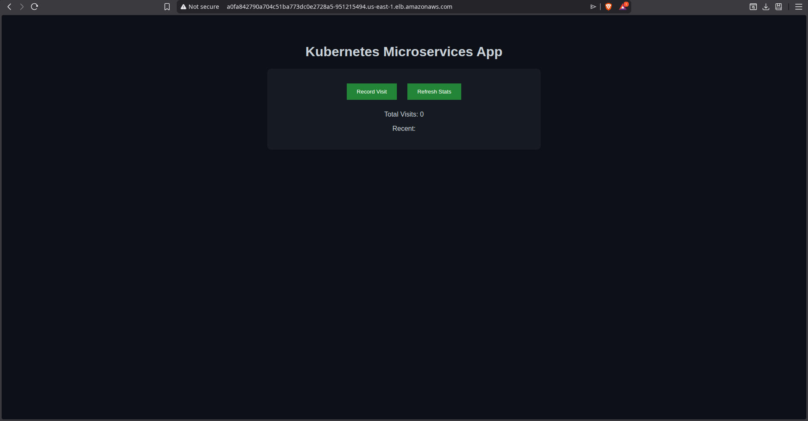
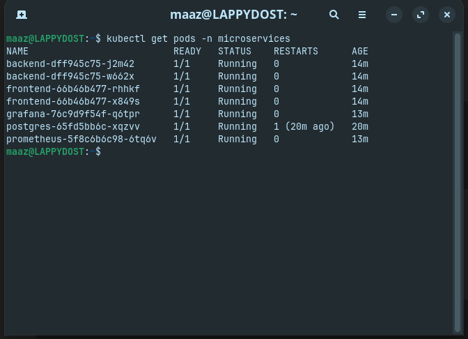
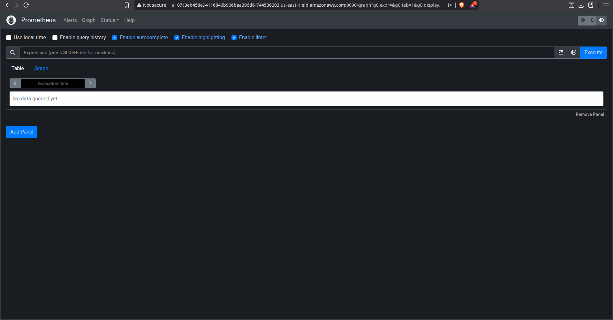
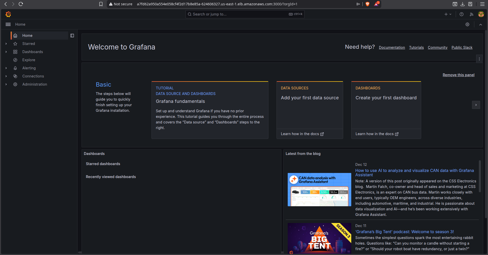

# Kubernetes Microservices Monitoring Platform

## Project Overview
Production-style microservices architecture deployed on AWS EKS using Docker, Kubernetes, CI/CD, monitoring, and auto-scaling.

---

## Tech Stack

- AWS EKS (Kubernetes)
- Docker
- Flask (Backend API)
- Nginx (Frontend)
- PostgreSQL
- Prometheus
- Grafana
- GitHub Actions (CI/CD)
- Horizontal Pod Autoscaler (HPA)

---

## Docker Images

- Backend: https://hub.docker.com/r/iknowmaaz/k8s-backend
- Frontend: https://hub.docker.com/r/iknowmaaz/k8s-frontend

---

## Architecture Features

- Containerized microservices
- Kubernetes deployments & services
- LoadBalancer exposure
- Auto-scaling via HPA
- Centralized monitoring (Prometheus)
- Dashboard visualization (Grafana)
- CI/CD pipeline for automated image builds

---

## Live Deployment Screenshots

### Application Running on AWS EKS

### Kubernetes Pods Running

### Prometheus Monitoring

### Grafana Dashboard

---

## Resume Description

Built and deployed a production-style microservices platform on AWS EKS using Docker, Kubernetes, GitHub Actions CI/CD, Prometheus, Grafana, and HPA auto-scaling.
